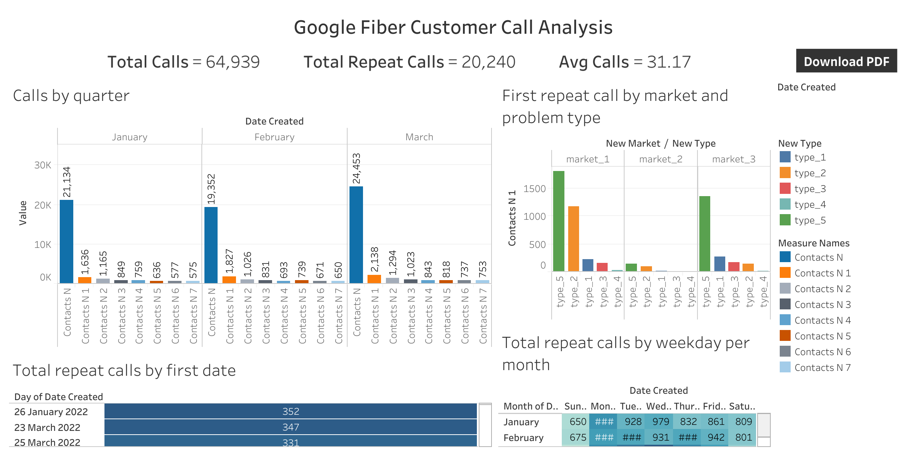
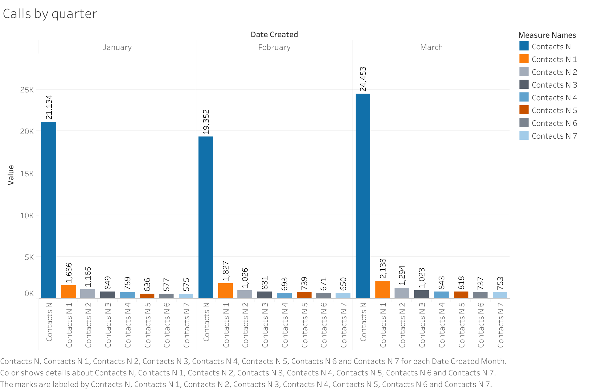
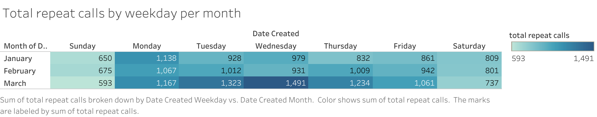
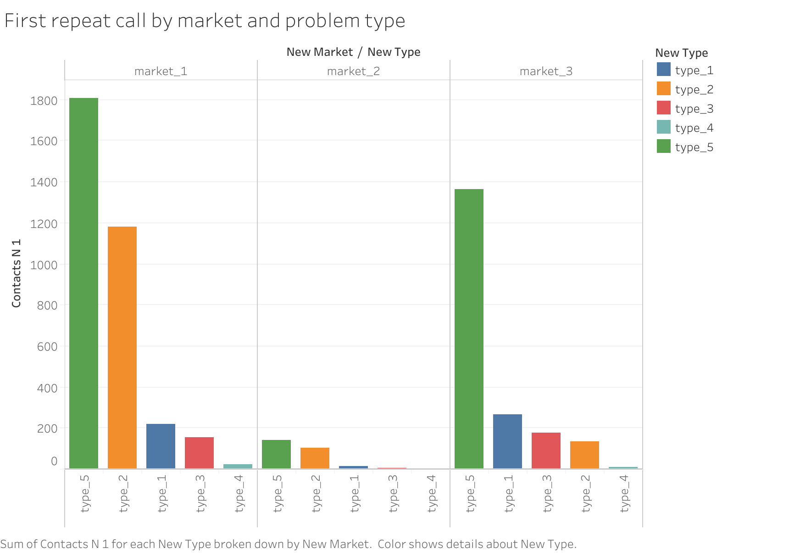
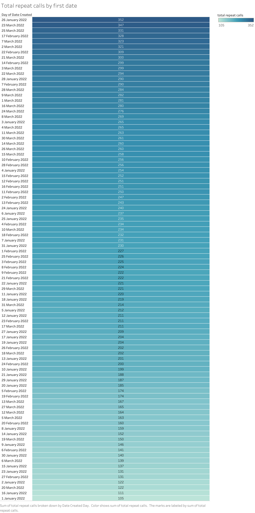

# Google Fiber Customer Call Analysis 📞📊

## Business Problem
Customer support teams are receiving a high volume of repeat calls, indicating that many customer issues are not fully resolved during the first interaction.

**Goal:**  
Identify patterns in repeat calls and provide insights to help reduce customer recall volumes and improve service efficiency.

Dashboard Link: [View Interactive Tableau Dashboard](https://public.tableau.com/views/GoogleBISpecializationFinalCertificate/GoogleFibreCustomerCallDashboard?:language=en-US&:sid=&:redirect=auth&:display_count=n&:origin=viz_share_link)

---

## Project Overview
This project analyzes customer call records to identify:

- Why customers are calling support multiple times
- Which markets experience the highest repeat calls
- Which problem types lead to repeated interactions
- When repeat calls most frequently occur

The analysis was performed using **Tableau** by combining 3 datasets (market level data) into one dataset for business intelligence reporting.

---

## Key KPIs

- **Total Calls:** 64,939  
- **Total Repeat Calls:** 20,240  
- **Average Repeat Calls per 100 calls:** 31  

### Insight
On average, **31 out of every 100 calls are repeat calls**, meaning approximately **30% of customer issues are not resolved on the first interaction**.

---

## Analysis Approach

The data was analyzed across 3 dimensions:

1. Total Repeat Calls by first contact date
2. Total Repeat Calls by Market
3. Total Repeat Calls by Problem Type

Including time scale comparisons:
- daily trends
- monthly patterns
- weekday behaviour
- repeat calls distribution

---

## Dashboard Overview

The dashboard provides a centralized view of repeat call behaviour across time, market segments, and problem categories.

---

## Key Insights

### 1. Repeat Calls Increase Over Time

- Repeat call volumes increase as months progress
- Indicates persistent service issues requiring follow-up support

---

### 2. Weekdays Have Higher Repeat Call Volumes

- Majority of repeat calls occur between **Monday and Friday**
- Suggests peak operational workload during business days

---

### 3. Market 1 Has Highest Repeat Calls

- **Market 1** support team experiences the highest repeat call volume
- Followed by **Market 3**
- Indicates possible service or process inefficiencies in specific regions

---

### 4. Problem Type 5 Drives Most Repeat Calls

- **Problem Type 5 (Internet/WiFi issues)** generates the highest repeat calls across all markets
- Followed by:
  - Type 2 (technical troubleshooting)
  - Type 1 (account management)

Problem category strongly impacts repeat call behaviour.

---

### 5. Peak Repeat Call Days Identified

- Certain dates show significantly higher repeat call volumes
- Useful for workforce planning and support optimization

---

## Data Accessibility for Stakeholders

Structured tables were included in the dashboard to allow stakeholders direct access to the underlying data along with visual insights.

---

## Tools Used

- Tableau
- Data Cleaning
- Data Analysis
- Business Intelligence
- Data Visualization
- Stakeholder-focused reporting

---

## Project Structure

google-fiber-call-analysis

│

├── data  
│   ├── Data.csv  
│   ├── market_1.csv  
│   ├── market_2.csv  
│   ├── market_3.csv  

├── documents  
│   ├── Google Fiber Customer Call Analysis report.pdf  
│   ├── Project Requirements Document.docx  
│   ├── Stakeholder Requirements Document.docx  
│   ├── Strategy document.docx  

├── images  
│   ├── Google Fibre Customer Call Dashboard.png  
│   ├── KPI Summary.png  
│   ├── Calls by quarter.png  
│   ├── First repeat call by market and problem type.png  
│   ├── Total repeat calls by weekday per month.png  
│   ├── Total repeat calls by first date.png  
│   ├── Tables.png  

└── README.md

---

## Business Impact

Reducing repeat calls can:

- improve customer satisfaction
- reduce support costs
- improve service efficiency
- optimize workforce allocation

Key focus areas:

- improve resolution quality for internet-related issues
- enhance troubleshooting processes
- allocate resources efficiently during peak days
- investigate service gaps in Market 1

---

## Author

Navyadeep Singh Boparai
Data Analytics | Dashboarding